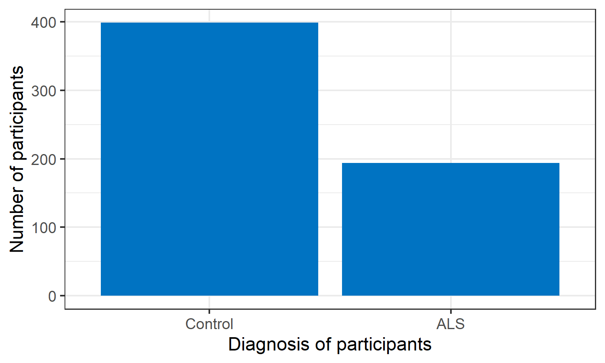
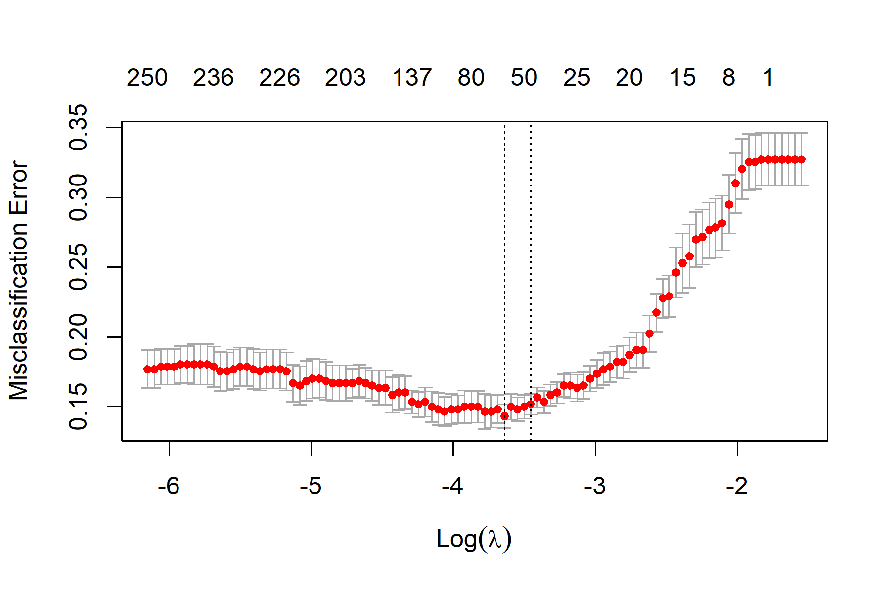
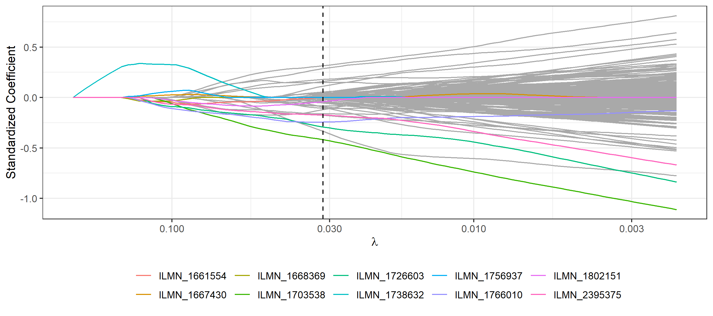

```{r setup, include=FALSE, message = FALSE}
options(scipen = 0, digits = 3)  # controls number of significant digits printed
library(tidyverse)
library(kableExtra)
```

\bigskip

The code to reproduce this report is available [on Github](https://github.com/Lozanoda/STAT_471_final).

\newpage

# Executive Summary

**Problem.** Amyotrophic lateral sclerosis (ALS) is a fatal neurodegenerative disease for which there is no curative treatment and due to its slow onset, lacks clear markers for early diagnosis. Genetic biomarkers of ALS could revolutionize drug discovery for the disease and help clinicians with early diagnosis, thus leading to much better outcomes for patients. For these reasons I decided to investigate if gene expression levels collected from patient's blood samples could accurately classify ALS patients. Which if true, could be very useful with early diagnosis of the disease. Furthermore, I was interested to see if the genes found to be most predictive of an ALS diagnosis could give insights into the biology underlying the disease.

**Data.** My dataset was an ALS research study obtained from the  National Institute of Health and submitted from the the University Medical Center Utrecht, in the Netherlands. This data set contained clinical and genetic data on over 700 patients. The explanatory variables were gene expression levels for all the genes detected in the patients blood samples. This consisted of around 29,000 genes, which I reduced to 2500 genes, essentially based on which genes were most likely to be changed between the classes. The primary response variable was patient diagnosis, which consisted of two classes, patients diagnosed with ALS and control patients.

**Analysis.** I first split my data into a training data set and a test data. I then explored the training data by assessing the characteristics of the feature variables, which were gene expression levels and the response variable, which was the diagnosis of the patient. A key aspect of this exploratory analysis involved assessing how gene expression levels differed between the ALS class and control patient class. After exploring the data, I then tuned and tested 5 different cross validated classification models: logistic regression, LASSO regression, ridge regression, elastic net regression, and random forest. Overall the lasso regression performed the test with a test missclassification error of 13.5%. The tree based, random forest model had a test missclassification error of 16%.

**Conclusions.** I found that by using solely genetic data, which was not used for the original diagnosis, penalized regressions and random forests were able accurately diagnose ALS patients vs. controls ~85% of the time. This was well above chance and suggests that genes found in easily accessible blood samples, could be important supplements to diagnosing ALS. Furthermore 2 features were present in the top 10 predictive features of the best performing models. These features were the Atp5a1 gene and  AIF1 gene, which I discovered were indeed verified by scientific studies to be crucial in the onset/progression of ALS. I hope that these results provide further evidence that genetic data can be important diagnostic indicators, as well as important tools for revealing the mechanisms underlying ALS disease pathology.

# Introduction

**Background.** Amyotrophic lateral sclerosis (ALS) is a fatal neurodegenerative disease that progressively deteriorates motor neurons in the brain and spinal cord. Approximately 5,000 new cases of ALS occur each year in the United States, with initial symptoms of the disease being as subtle as muscle twitches in the limbs but respiratory muscle failure commonly occurring within 2-5 years of initial symptom presentation.^[Amyotrophic Lateral Sclerosis (ALS) Fact Sheet | National Institute of Neurological Disorders and Stroke. https://www.ninds.nih.gov/Disorders/Patient-Caregiver-Education/Fact-Sheets/Amyotrophic-Lateral-Sclerosis-ALS-Fact-Sheet/. 
]. Currently there is no known cause of ALS, as it is a highly heterogeneous disease, arising from a combination of genetic and environmental factors. Due to this complexity, early diagnosis is difficult and only 2 FDA approved medications exist, which have been shown to increase survival by a few months.^[Amyotrophic Lateral Sclerosis (ALS) Fact Sheet | National Institute of Neurological Disorders and Stroke. https://www.ninds.nih.gov/Disorders/Patient-Caregiver-Education/Fact-Sheets/Amyotrophic-Lateral-Sclerosis-ALS-Fact-Sheet /.].

A key development that would greatly accelerate continuing drug discovery and early diagnosis would be the discovery of a genetic biomarker for ALS. The discovery of a reliable biomarker, which could distinguish ALS patients early on, would lead to insight into which cellular and genetic pathways contribute to disease progression and thus lead to better drug targets. A blood biomarker would be the most advantageous, as it is much less invasive than tissue biopsies or cerebrospinal fluid samples and would be readily accessible for the majority of patients. Past research has found reliable risk factor gene mutations in certain families with highly heritable forms of ALS, theses genes seem to be involved in the mRNA processing and autophagy (waste clearance) cellular pathways.^[Balendra and Isaacs,  C9orf72-Mediated ALS and FTD. https://www.ncbi.nlm.nih.gov/pmc/articles/PMC6417666/.]. Unfortunately, the majority of ALS cases are not of this highly heritable form and more research is needed for finding which genes or combinations of genes could serve as reliable biomarkers in the majority of sporadic ALS cases.^[Amyotrophic Lateral Sclerosis (ALS) Fact Sheet | National Institute of Neurological Disorders and Stroke. https://www.ninds.nih.gov/Disorders/Patient-Caregiver-Education/Fact-Sheets/Amyotrophic-Lateral-Sclerosis-ALS-Fact-Sheet/.].


**Analysis goals.** As this dataset is one of the largest ever collected on ALS patients, I thought it would provide a great opportunity to investigate two major questions. One question was if/how well can modern edge data science techniques reliably classify ALS patients based only on their genetic data, which is rarely taken into consideration during clinical diagnosis. The second question was, what would be the subset of genes which would prove to the most important determinants in classifying ALS patients and what are these genes involved in.

**Significance.** Based on these goals, I hope that the results from this report provide further support that large scale genetic data can be  useful in accurately diagnosing patients. Furthermore these results may be able to find novel genes/pathways which could be of importance to the disease  or further confirm the importance of established ALS related genes and cellular pathways.

# Data

## Data sources

My dataset was obtained from the National Center for Biotechnology Information Gene Expression Omnibus (GEO), this is an international public repository that contains large scale genomic data submitted by individual researchers for public access. ^[https://www.ncbi.nlm.nih.gov/geo/info/overview.html.]. The submitted study I chose for this project was titled “Whole blood transcriptome analysis in amyotrophic lateral sclerosis: a biomarker study”^[ https://www.ncbi.nlm.nih.gov/geo/query/acc.cgi?acc=GSE112676.]

This study consisted of a dataset that contained blood mRNA expression of ALS patients and non ALS patients. The dataset was collected in Utrecht, Netherlands by the University Medical Center Utrecht and was made public on April, 05, 2018. The study was designed to identify blood genetic biomarkers for ALS. The dataset contained various files of which I chose to analyze three. The first of which is the file containing the mRNA expression levels for 29,830 gene transcripts for all of the patients. These expression values were log2 transformed and quantile normalized, which is standard for the field. The second file is clinical information file for each of the patients, with information such as which patient diagnosis sex, age at diagnosis, etc. Lastly there was a file which included documentation of the gene transcript, such as the associated functions of each transcript, the exact genetic sequence, etc.. I used an R package named "GEOquery" to download these files.  

## Data cleaning

One of my main task in cleaning the data was in merging the  files to get one dataset that was in the tidy format. To achieve this, I had to find a common identifier that I could use to relate the gene expression data file from each patient to their clinical information file. This identifier was provided as each patient’s geo accession id. So after I trimmed the clinical information dataset to just each patient’s clinical diagnosis and their geo accession id, I joined this tibble to the processed gene expression tibble. This resulted in my final tidy tibble that contained all the gene expression levels for each patient as a feature and the final column was each patients diagnosis status which would serve as the response variable. 

My other major task involved reducing the number of gene transcripts I would use for analysis, since 29,000 proved to be computationally infeasible for my resources. So I decided to use only gene transcripts that had no NA values for the associated cellular functional data. This allowed me to see which pathways and processes could be important in discriminating between the patient groups, this reduction step left me with around 12,000 gene transcripts. I then calculated the variance of each transcript in the dataset and selected the top 2,500 transcript with the most variance, which is an accepted practice in this field. and was used in page 345 of our ISLRv2 textbook ^[ Sohil, Sohali, and Shabbir, An Introduction to Statistical Learning with Applications in R.].

Lastly I cleaned the text of the data frame describing the genes and their associated function to make it presentable for reading in this format and also for wordcloud processing. 

## Data description

### Observations

My dataset had a total of 741 observations with each observation representing a patient. 

### Response Variable

My response variable was patient diagnosis, which could be ALS or control. 233 of the response variables were ALS patients and 508 were control. I was mindful of a class imbalance, which I compensated for by tuning the threshold probability during the evaluation of the models. 

### Features

I had 2,500 features in data set, each of which represented mRNA expression of gene transcripts, unfortunately describing these many genes in detail was unfeasible. However in the Appendix \@ref(appendix), I provided extended features details such as the full gene name, the cellular organelle and cellular function linked to the variables, for the subset of features used in the data exploration section.


## Data allocation

As described in the data cleaning, I decided to only choose features that had no missing values and thus I did not have to remove any observations for inputs into my model predictions. I then decided to split the dataset into training/testing data with a 80/20 split. I decided this would be agreeable with my data because each of my observations is a patient and all patients have the same gene data were selected to be analyzed. In other words it  was my assumption that each observation is independent of each other, while being fairly uniform in features at the same time. I was weary of potential class imbalance as the dataset had 741 total patients, but only 233 of which were ALS patients. With the 80/20 split I ended up with ~48% of the training data being ALS patients and ~27% in the test set. I decided to keep this distribution as I thought it would be advantageous to have more ALS patients used in fitting the model than testing the model. Furthermore, I decided that I would address class imbalance, especially in my test set, during the tuning of my models. I ensured that the same training/testing datasets would be used for all the models by setting a seed for the split and saving the training and testing data as files which would then be loaded into each model. 

## Data exploration

### Response

In Figure \@ref(fig:response-histogram), I quantified the response variable in the training data set, which was patient diagnosis and observed that 399 were ALS patients and 194 were control.   


```{r response-histogram, out.width = "80%", fig.cap = "Distribution of ALS and non ALS patients.", fig.align='center', echo = FALSE}

```


### Features

To understand the genetic data provided I first sought to look at the overall distribution of gene expression values in the dataset as shown in Figure \@ref(fig:feature-response-histogram). The expression values had been log2 transformed and quantile normalized by the original researchers, which resulted in a fairly tight range of values with most  values ranging from 6 to 15. The mean expression value of this dataset was 8.6. I also looked at how the expression values for all the training features differed across the classes and could not see a noticeable difference (not shown).

```{r feature-response-histogram, out.width = "80%", fig.cap = "Distribution of genetic expression values for all features in training set", fig.align='center', echo = FALSE}
knitr::include_graphics("../results/exp-histogram.png")
```

Next I decided to look at the profiles a subset of genes that could be key predictors in distinguishing the two patient type. The first subset I chose to look at was a subset of the 40 features with the highest variance in the dataset. I chose to look at this subset as it is commonly thought that features with the most variance are more likely to be key in distinguishing between response classes. When I investigated how the expression values for this subset of features differed between the groups, I saw that the ALS group had slightly elevated expression levels compared to the control (Figure \@ref(fig:top40box)). I also was interested in seeing the correlations between the genes and if these differed across the patient groups. These results of the 5 most variable genes are shown in  Figure \@ref(fig:top40pairs) indicate that in this subset, many are correlated with each other as denoted by the asterisks. This could be due to many of the genes in this subset being involved in the same cellular pathways/functions. These correlations did not seem to be heavily altered by patient diagnosis, indicating that while some genes might be expressing at higher levels in the ALS group, their relationship with other gene may not necessarily be changing.

```{r top40box, out.width = "80%", fig.cap = "Difference in total gene expression between ALS and control patients", fig.align='center', echo = FALSE}
knitr::include_graphics("../results/top40_boxplot.png")
```
```{r top40pairs, out.width = "80%", fig.cap = "Correlations of top 5 most variable genes to each other and across classes", fig.align='center', echo = FALSE}
knitr::include_graphics("../results/top40_pairs.png")
```
Based on these results from Figure \@ref(fig:top40box), I was interested in seeing which features were the ones increased in the ALS class. Thus I calculated how the mean expression values of each feature differs between the groups. The results from Figure \@ref(fig:top40), which represents the subtracted the mean gene expression values of the ALS group from the control group, show that 32 of the 40 most variable features had increased expression levels in the ALS group. 

To understand what the genes which showed increased expression in ALS group could be involved in, I  decided to create visual word clouds of where in the cell (cellular organelles) these increased genes are localized to and what cellular pathways the genes are involved in (For the more details about these selected genes refer to the Appendix \@ref(appendix)). Figure \@ref(fig:upcomp) shows these upregulated genes were commonly localized to the cellular membrane, protein/receptor complexes and the cell's nucleus. Figure \@ref(fig:upproc) shows that these upregulated genes are commonly involved in the immune and cellular defense response, as well as cellular transport.(I have also included descriptive word clouds for the downregulated genes in the Appendix \@ref(appendix) ). These associated cellular regions and functions  align with many studies that have linked the motor neuron death that occurs in ALS to the inflammation response and protein recycling which heavily rely on cellular transport pathways.  ^[Amyotrophic Lateral Sclerosis (ALS) Fact Sheet | National Institute of Neurological Disorders and Stroke. https://www.ninds.nih.gov/Disorders/Patient-Caregiver-Education/Fact-Sheets/Amyotrophic-Lateral-Sclerosis-ALS-Fact-Sheet /.]

```{r top40, out.width = "80%", fig.cap = "Gene expression changes in ALS patients relative to controls" , fig.align='center', echo = FALSE}
knitr::include_graphics("../results/top40_changes.png")
```

```{r upcomp, out.width = "80%", fig.cap = "Common cell organelles for genes most upregulated ALS (from 40 most variable genes) " , fig.align='center', echo = FALSE}
knitr::include_graphics("../results/top40_up_component.png")
```
```{r upproc, out.width = "80%", fig.cap = "Common cellular functions for genes most upregulated ALS (from 40 most variable genes)" , fig.align='center', echo = FALSE}
knitr::include_graphics("../results/top40_up_process.png")
```
I found the analysis of comparing which features are increased or decreased in the ALS patients to be very informative. Thus I decided to look at the top 40 genes which were most increased/decreased in the ALS group across the entire training dataset, not just the 40 most variable genes, which is shown in Figure \@ref(fig:highlow). Figure \@ref(fig:allupcomp) revealed that the genes whose expression was most increased in the ALS patients were heavily involved in cell membrane structures, with the second most common being those involved in the cell nucleus. As for the functional information, Figure \@ref(fig:allupproc) revealed that these genes were also strongly involved in various regulation pathways, such as neuronal synaptic regulation, cell death regulation, and gene survival regulation.  Figure \@ref(fig:allupproc) also showed that many of these genes were involved in protein degradation (refered to as ubiquitination) and protein transport. I found these results compelling as they were consistent with results of the 40 most variable genes and research in the field. 

Next, I decided to look at the characteristics of the genes which were most decreased in the ALS class and if they differed from the upregulated genes. Figure \@ref(fig:alldowncomp) shows that these decreased ALS genes are heavily involved in the cell membrane and nucleus which was similar to the upregulated genes. However many were also being involved in the mitochondria, which was not as common in the upregulated genes. Figure \@ref(fig:alldownprocess) shows that these genes are involved in transport of various kinds, including protein transport, ion transport and cholesterol transport. This was similar to the upregulated genes, albeit not as many in the upregulated genes were involve ion transport. Many were also involved in RNA transcription regulation and processing, which was a commonality to the upregulated genes. 

```{r highlow, out.width = "80%", fig.cap = "The top 20 genes most upregulated and top 20 most downregulated in ALS patients" , fig.align='center', echo = FALSE}
knitr::include_graphics("../results/high_low_bar.png")
```
```{r allupcomp, out.width = "80%", fig.cap = "Common cell organelles for genes most upregulated in ALS (all genes)" , fig.align='center', echo = FALSE}
knitr::include_graphics("../results/exp_diff_up_component.png")
```

```{r allupproc, out.width = "80%", fig.cap = "Common cellular functions for genes most upregulated ALS (all genes)" , fig.align='center', echo = FALSE}
knitr::include_graphics("../results/exp_diff_up_info_process.png")
```
```{r alldowncomp, out.width = "80%", fig.cap = "Common cell organelles for genes most downregulated in ALS (all genes)" , fig.align='center', echo = FALSE}
knitr::include_graphics("../results/exp_diff_down_info_component.png")
```

```{r alldownprocess, out.width = "80%", fig.cap = "Common cellular functions for genes most upregulated ALS (all genes)" , fig.align='center', echo = FALSE}
knitr::include_graphics("../results/exp_diff_down_info_process.png")
```

# Modeling

## Regression-based methods

### Logistic regression

I began my analysis by fitting a logistic regression on the all of the 2,500 features in the training set. I initially sought to use this fit to interpret the coefficients and extract insight into which of the genetic transcripts would be the most important predictors of patients diagnosis. As mentioned previously, the features in the data set had been log2 transformed and quantile normalized by the original researchers, as this is standard procedure for many publicly available genetic data sets. For this reason I felt it was not necessary to further transform or normalize the data.

After the logistic regression was fit, I extracted the top 10 coefficients with the most positive values as well as the the top 10 most negative coefficients. Table \@ref(tab:glm-coefficients) shows these selected features, coefficients estimates,(sorted by descending value) and their associated cellular pathways for each of the coefficients. Interestingly, the variable with the highest positive coefficient was the gene NOVA1, which is localized to the cell nucleus and whose function is  crucial to locomotion activity, the main deficit in ALS. Overall, many of the variables with the top positive coefficients were localized to the cell nucleus and cell membrane. Their function was commonly linked to cellular transport pathways and transcription regulation. This was in agreement with the associated functions of the upregulated genes that were explored earlier and further indicated that alterations in cellular transport and transcription occur in ALS, which is indeed a common consensus in the field. As for the variable with the most negative coefficient values, they were also commonly localized to the plasma membrane and nucleus. Their associated functions did differ from the variables with positive coefficients in that there were  more genes associated with ion transport and cell signaling. The downregulated genes previously explored were also linked to signaling and transport pathways.
  
Lastly I sought to address a potential class imbalance in the data set by tuning the probability threshold to see which threshold value would give the optimal missclassification error.The results shown in Table \@ref(tab:glm-tune) demonstrate that is there is no optimal threshold value, as all the values provide the same missclassification error. This result occurred because the predicted probabilities for the classes were very close to 1 or an real number multiplied by e-16, meaning that essentially the probabilities already set the prediction at 0 or 1. Thus varying the thresholds would not change the result. This reveals that the logistic regression has a very poor performance in distinguishing between ALS and control subjects and is essentially guessing at chance. This poor performance is likely due to high variance overwhelming the model, as the number of features in the data set is more than triple the number of observations.
  
```{r glm-coefficients, message = FALSE, echo = FALSE}
read_tsv("../results/glm_coeffs_20.tsv") %>%
  kable(format = "latex", row.names = NA, 
        booktabs = TRUE, digits = 2, 
        caption = "Feature variables with the top 10 largest logistic coefficients ") %>%
  kable_styling(position = "center")%>%
  kable_styling(latex_options = c("scale_down","HOLD_position"))
```

```{r glm-tune, message = FALSE, echo = FALSE}
read_tsv("../results/glm_threshs.tsv") %>%
  kable(format = "latex", row.names = NA, 
        booktabs = TRUE, digits = 2, 
        caption = "Missclassification error and related metrics for various thresholds") %>%
  kable_styling(position = "center") %>%
  kable_styling(latex_options = "HOLD_position")
```

### Penalized regression

Given that the logistic regression's poor performance was likely due to the high dimensional nature of the data, I decided to run penalized regressions which are more optimize for dealing with datasets with a large amount of features. Of the penalized regression models, I chose to run the ridge, LASSO (Least Absolute Shrinkage and Selection Operator), and elastic net models. All of these models went through  cross-validation to select the optimal values of lambda according to the one-standard-error rule. 

*Lasso:* I show in Figure \@ref(fig:lasso-CV-plot) the cross validation plot for the Lasso, which demonstrates that the optimal model has only 46 feature. Table \@ref(tab:lasso-coefficients) shows the top 20 of these selected features. From the top 20 features, it can be seen that many of the selected genes are localized to nucleus and the mitochondrion, along with being important for cellular transport and RNA processing pathways.

Figure \@ref(fig:lasso-trace-plot) essentially highlights the 10 most important features chosen by the model, and Table \@ref(tab:lasso-coefficients) shows the highlighted features exact coefficient values and their related functional cellular data.

I also tested various classification thresholds shown in Table \@ref(tab:lasso-tune), which shows that the standard 0.5 threshold as being the optimal one.

```{r lasso-CV-plot, out.width = "90%", fig.cap = "Lasso CV plot.", fig.align='center', echo = FALSE}

```

```{r lasso-coefficients, message = FALSE, echo = FALSE}
read_tsv("../results/lasso-features-table.tsv") %>%
  kable(format = "latex", row.names = NA, 
        booktabs = TRUE, digits = 2, 
        caption = "Standardized coefficients for features in the lasso 
        model based on the one-standard-error rule.") %>%
  kable_styling(position = "center") %>%
  kable_styling(latex_options = c("scale_down","HOLD_position"))
```


```{r lasso-trace-plot, out.width = "90%", fig.cap = "Lasso trace plot.", fig.align='center', echo = FALSE}

```


```{r lasso-trace-coefficients, message = FALSE, echo = FALSE}
read_tsv("../results/lasso_trace_features.tsv") %>%
  kable(format = "latex", row.names = NA, 
        booktabs = TRUE, digits = 2, 
        caption = " Descriptions of the 10 selected features shown in the Lasso trace plot") %>%
  kable_styling(position = "center") %>%
  kable_styling(latex_options = c("scale_down","HOLD_position"))
```

```{r lasso-tune, message = FALSE, echo = FALSE}
read_tsv("../results/lasso_threshs.tsv") %>%
  kable(format = "latex", row.names = NA, 
        booktabs = TRUE, digits = 2, 
        caption = "Missclassification error and related metrics for various thresholds") %>%
  kable_styling(position = "center") %>%
  kable_styling(latex_options = "HOLD_position")
```


*Elastic Net:* I found that the ideal elastic net model also proved to be a lasso regression, as Figure \@ref(fig:elnet-CV-plot) shows that the cross validation plot is the exact same as Figure \@ref(fig:lasso-CV-plot) and the optimal alpha chosen was 1. Hence the trace plot of the top selected features (Figure \@ref(fig:elnet-CV-plot) is also identical to those chosen by the lasso. The details of the genes can be found in Table \@ref(tab:lasso-coefficients), and the  the optimal threshold can be found in Table \@ref(tab:lasso-tune)

```{r elnet-CV-plot, out.width = "90%", fig.cap = "Elastic net CV plot.", fig.align='center', echo = FALSE}
knitr::include_graphics("../results/elnet-cv-plot.png")
```
```{r elnet-trace-plot, out.width = "90%", fig.cap = "Elastic net trace plot.", fig.align='center', echo = FALSE}
knitr::include_graphics("../results/elnet-trace-plot.png")
```

*Ridge:*  Figure \@ref(fig:ridge-CV-plot) shows the cross validation plot for the Ridge regression. Figure \@ref(fig:ridge-trace-plot) highlights the 10 most important features chosen by the model, and Table \@ref(tab:ridge-trace-coefficients) shows the highlighted features exact coefficient values and their related functional cellular data. Similar to the lasso results, these highlighted genes are localized to nucleus and the mitochondrion, and are involved in cellular transport and RNA processing pathways. Lastly, I show the threshold tuning in Table \@ref(tab:ridge-tune), which again shows that the standard 0.5 threshold is being the optimal one.

```{r ridge-CV-plot, out.width = "90%", fig.cap = "Lasso CV plot.", fig.align='center', echo = FALSE}
knitr::include_graphics("../results/ridge-cv-plot.png")
```

```{r ridge-trace-plot, out.width = "90%", fig.cap = "Ridge trace plot.", fig.align='center', echo = FALSE}
knitr::include_graphics("../results/ridge-trace-plot.png")
```

```{r ridge-trace-coefficients, message = FALSE, echo = FALSE}
read_tsv("../results/ridge_features.tsv") %>%
  kable(format = "latex", row.names = NA, 
        booktabs = TRUE, digits = 2, 
        caption = " Descriptions of the 10 selected features shown in Ridge trace plot") %>%
  kable_styling(position = "center") %>%
   kable_styling(latex_options = c("scale_down","HOLD_position"))
```
```{r ridge-tune, message = FALSE, echo = FALSE}
read_tsv("../results/ridge_threshs.tsv") %>%
  kable(format = "latex", row.names = NA, 
        booktabs = TRUE, digits = 2, 
        caption = "Missclassification error and related metrics for various thresholds") %>%
  kable_styling(position = "center") %>%
  kable_styling(latex_options = "HOLD_position")
```

## Tree-based methods

### Random forest

I chose to fit a random forest, with the aim of seeing how a model which can consider more non linear solutions performs in this complex classification task.
To optimize the random forest model I tested 25 different values m values (ranging from 1-2500), which are the number of features the model considers before making a split. Figure \@ref(fig:meval) shows the results of this testing, which revealed that m=1896 provided the lowest error. Figure \@ref(fig:mtree) shows how the random forest with the chosen M value performs as the number of trees increase from 1 to 500 trees, which correspond to the number of bootstraps the model aggregates over. This shows that there is a significant drop in the out of bag error after roughly 80 trees and the drop in error levels off around 400 trees. As the higher number of trees generally leads to better test performance I decided to use 500 trees for the tuned random forest model. 

The features which the tuned model chose as most important to making its classification are shown in Figure \@ref(fig:rfimport). Table \@ref(tab:rfacc), shows the 15 most important variable as chosen by the mean decrease in accuracy index, which essentially is a measure of how much a  model's prediction accuracy is reduced when a feature is not included in the model. These features were genes that were commonly localized to the nucleus, the mitochondria, and cell membrane. Many of these genes were involved in RNA processing as well as stress and transport pathways. Table \@ref(tab:rfgini), shows the 15 most important variables as chosen by the gini index, which is measure of how much the model improves its classification when it splits on that given variable. These genes had many of the same characteristics as the ones chosen by the accuracy index, with the slight difference of having more genes that were localized to the cytoplasm/extra cellular space and more involved in various protein pathways vs RNA pathways.


```{r meval, out.width = "90%", fig.cap = "Testing m values to find optimal value", fig.align='center', echo = FALSE}
knitr::include_graphics("../results/rf_m_oob.png")
```

```{r mtree, out.width = "90%", fig.cap = "Optimal M value performace across 1-500 trees", fig.align='center', echo = FALSE}
knitr::include_graphics("../results/rf_trees_oob.png")
```


```{r rfimport, out.width = "90%", fig.cap = "Features of most importance to random forest class predictions", fig.align='center', echo = FALSE}
knitr::include_graphics("../results/rf_varImpPlot.png")
```

```{r rfacc, message = FALSE, echo = FALSE}
read_tsv("../results/rf_acc.tsv") %>%
  select(-c("MeanDecreaseAccuracy","MeanDecreaseGini"))%>%
  kable(format = "latex", row.names = NA, 
        booktabs = TRUE, digits = 2, 
        caption = "Specification of the 15 most important genes, as chosen by the mean decrease in accuracy index") %>%
  kable_styling(position = "center") %>%
  kable_styling(latex_options = c("scale_down","HOLD_position"))
```

```{r rfgini, message = FALSE, echo = FALSE}
read_tsv("../results/rf_gini.tsv") %>%
  select(-c("MeanDecreaseAccuracy","MeanDecreaseGini"))%>%
  kable(format = "latex", row.names = NA, 
        booktabs = TRUE, digits = 2, 
        caption = "Specification of the 15 most important genes, as chosen by the mean decrease in Gini index") %>%
  kable_styling(position = "center") %>%
 kable_styling(latex_options = c("scale_down","HOLD_position"))
```
# Conclusions

## Method comparison

```{r modelevaluation, message = FALSE, echo = FALSE}
read_tsv("../results/model_evaluation.tsv") %>%
  kable(format = "latex", row.names = NA,
        booktabs = TRUE, digits = 3,
        caption = "Test Missclassifcation error of tuned models") %>%
  kable_styling(position = "center") %>%
  kable_styling(latex_options = "HOLD_position")
```

Table \@ref(tab:modelevaluation) shows the test missclassifcation rate at the optimum threshold, and false positive/negative rates for all the methods considered. As an model class the penalized regressions, which were the Lasso and ridge performed the best. This was slightly surprising, as I predicted  the random forests to have the best performance, as I thought there would be more non linearity in the high dimensional data. The fact that the penalized regressions perform the best, indicates that reducing the dimensions/complexity of the features was most key to accurate classification in this dataset. 

Thus the model that reduced the features the most, the Lasso regression, slightly outperformed the ridge by having the best overall test error of 0.135 or 13.5%. Furthermore, the lasso had the best false negative rate (33%) of all the models, indicating its algorithm reduced the amount of ALS patients which were classified as control. However the ridge had the lowest false positive rate at 5.5% (besides the logistics, which performed poorly overall), indicating that it was the best at properly distinguishing control patients from ALS patients. It seems though that it is difficult to develop an model which maintains the  false positive performance of the ridge, and the false negative performance of the LASSO, since the elastic net's attempts to do this resulted in a full lasso model.  The random forest model did perform much better (missclassification rate 16.2%) than the standard logistic regression model (missclassification rate 40.2%), but it did not outcompete the penalized regressions. Lastly given that all the regression models performed best at the standard threshold of 0.5 this indicates that the class imbalance was likely not a key driver of the missclassificaiton error. 

There were general themes of which types of genes were chosen as top predictors by the models. The most common were genes localized to the cell membrane and cell nucleus. These genes were often involved in cellular transport of stress responses and RNA regulation. Slightly less common were genes in involved in the mitochondria and cytoplasm, which were commonly involved in stress responses, ion and protein transport. Surprisingly out of the thousands of genes there were two specific genes which were present in the lasso, ridge and random forest as top 15 predictor, these were the following: ATP5I, AIF1 (Table \@ref(tab:topgenes)). Moreover, these 9 genes were present as top 15 predictors in two of the three top models: CDC37, YARS, GABBR1, DEGS1, MRPS18c, TRDMT1, MMP9, SLC20A1, PRKAR1A (Table \@ref(tab:topgenes)).

```{r topgenes, message = FALSE, echo = FALSE}
read_tsv("../results/top_genes_mul_models.tsv") %>%
  kable(format = "latex", row.names = NA,
        booktabs = TRUE, digits = 3,
        caption = "Genes which are top 15 predictors in multiple models") %>%
  kable_styling(position = "center")  %>%
 kable_styling(latex_options = c("scale_down","HOLD_position"))
```

## Takeaways

My results show that analyzing genetic data can be of great value in diagnosing a complex disease such as ALS, as the best model was was able to distinguish ALS patients and control patients around 87% of the time, using only genetic data. In reality, a clinical diagnosis of ALS involves multiple hospital visits, usually over a protracted period of time and is only distinguishable from other possible diseases once the physical symptoms are severe. The majority of these patients never have any kind of genetic screening to help with the clinical diagnosis. Even this data set which is one of the largest collected on ALS patients, had only collected hundreds of ALS patient over years. This is pails in comparison to the thousands of clinical ALS diagnoses that are registered every year in just the U.S. 

With genetic screening becoming more accessible, this data suggests that regular genetic screenings from the  blood samples from patients could serve as a very accessible and useful supplement to help clinicians make earlier diagnoses. However I think this data also suggests that diagnoses should not be made solely  on genetic data, as an missclassification rate of 87% is still too low to be reliable in a clinical setting. But it could be a key supplement for expert clinicians treating the disease.  Moreover, if genetic screenings did become more prevalent this would allow for larger datasets and more accurate genetic profiles for ALS. These larger data sets would not only help with diagnosing ALS but also with better understanding of the biological processes underlying disease and  possible treatments.

To that end, my findings also revealed that two genes were especially key in helping the 3 best performing models classify between ALS patients and control patients. These two genes could be insights into the biology drving the disease. The first of these genes was the Atp5a1 gene, which is important for mitochondrial function. Interestingly a 2019 scientific study in a leading journal, found that ALS onset in ALS mouse models of the disease was in part caused by abnormal Atp5a1 expression and mitochondrial defects via this dysfunction in the pathway^[Choi et al., “C9ORF72-ALS/FTD-Associated Poly(GR) Binds Atp5a1 and Compromises Mitochondrial Function in Vivo.”]. The second gene was the AIF1 gene, which is involved in the cellular inflammatory stress response. For this gene, there were also studies in both humans and mice, which linked AIF1 to  being involved in ALS. It was especially important for the degeneration of neurons in ALS via the glia inflammatory pathway^[Tam, Oliver H., Nikolay V. Rozhkov, Regina Shaw, Duyang Kim, Isabel Hubbard, Samantha Fennessey, Nadia Propp, et al. “Postmortem Cortex Samples Identify Distinct Molecular Subtypes of ALS: Retrotransposon Activation, Oxidative Stress, and Activated Glia.” Cell Reports 29, no. 5 (October 29, 2019): 1164-1177.e5. https://doi.org/10.1016/j.celrep.2019.09.066.
] ^[Peng et al., “Loss of TDP-43 in Astrocytes Leads to Motor Deficits by Triggering A1-like Reactive Phenotype and Triglial Dysfunction.”]. Overall the ability of the models to extract these two genes, from the thousands in the dataset, which are verified as causal contributers to ALS onset and progression is very exciting. Perhaps with larger datasets or more complex models more genes such as these or even novel genes, which are crucial to the disease, can be discovered and used to develop better treatments. 


## Limitations

### Dataset limitations

A key limitation of this dataset is that the gene expression values had undergone preprocessing and normalization steps at the discretion of the original researchers. It is entirely conceivable that if a different normalization pipeline had been used on the data, that would lead to different features being selected as important by the predictive models or even ultimately changing model performance. A second limitation of that dataset is the limited number of patients. While 700 observations is well above the requirement for this report, when there are 29,000 or even 2,500 features, that leads to high dimensional data, which requires careful analysis and model tuning. The problem caused by this high dimensional data was clearly shown by the poor performance of the logistic regression model. This model  was clearly overwhelmed with the variance introduced by have some many more features than observations and a dataset with less feature would likely been better for a logistic regression. Lastly there was a small class imbalance, as there were 233  ALS patients and 508 control patients in the entire dataset and this distribution was even more imbalanced in the test set used here. Fortunately in this case it seemed to not be a major issue, as the best threshold was still 0.5 but it is still not ideal to have uneven classes. 


### Analysis limitations

Due to the computational costs of analyzing all the 29,000 features, I was only able to use 2,500 of the most variable features in my analysis. Not being able to use all the gene feature data available was in my opinion was the biggest limitation in my analysis. While selecting a subset of genes based on variance is an accepted method, it is possible that I was missing features that could have led to better performance or been more predictive than the 2,500 selected features. However even with 2,500 features, I was limited in the analysis I could do because of computational costs. For example it was not possible to visualize or compute the relationships of all 2,500 to each other or to the response variable. For this reason, I could only include subsets of 40 genes in my exploratory analysis, because creating correlation plots for 2,500 was not possible for my computer. Even if it was computationally feasible these plots would not have been interpretable. Also it was limiting to not know the details of all the features in my data set, this made comparing which features were most important across models much more difficult than in datasets with less than 100 features. Overall the high dimensionality of the data proved to be very difficult analysis problem, as it meant many viable features were excluded, interpretability of features/feature importance was lost and models took much longer to run. 


## Follow-ups

As a follow up to overcome the data limitations, I would recommend adding more ALS datasets in order to increase the  number of observations and even the classes.  It could also be interesting to access the unprocessed files and experiment with different normalization methods of the data to see if the results are altered. As for analysis follow ups I would recommend trying models that are highly adept at high dimensional data such as neural networks of various kinds. Lastly it would be very informative to see if selecting a subset of the data by some other dimensionality reduction technique ,such as PCA, would lead to similar results. 


\appendix

# Appendix: Descriptions of features used in exploratory analysis {#appendix}

Table \@ref(tab:40mostvar) shows the details of the 40 most variable genes in the training data set that provide insight into the gene function and associations. 

These details include:

**1.** The feature ID, which is the name used in most of the feature plots in the report.

**2.** The gene acronym, the most common way to refer to a gene in the field.

**3.** The extended gene name from which the acronym arises.

**4.** The associated cellular component which describes a cellular organelle the gene has been localized to. In reality genes are often expressed in many organelles but for simplicity/comprehension only 1 is shown for each gene

**5.** The associated cellular process,this aims to cover the general cellular pathway the genes have been linked to, such as DNA regulation.

**6.** The associated cellular function, this aims to be slightly more specific than pathways and state within the pathway what specific task the gene is important for, for example zinc ion binding.


```{r 40mostvar, message = FALSE, echo = FALSE}
read_tsv("../results/ALS_40_diff_info.tsv") %>%
  kable(format = "latex", row.names = NA, 
        booktabs = TRUE, digits = 2, 
        caption = "Specifications of 40 most variable gene transcripts in training set ") %>%
  kable_styling(position = "center") %>%
  kable_styling(latex_options = c("scale_down","HOLD_position"))
```

**20 most upregulated gene transcripts in ALS patients:**

Table \@ref(tab:20top) shows the details of the 20 genes which were most upregulated in ALS patients.

```{r 20top, message = FALSE, echo = FALSE}
read_tsv("../results/exp_diff_up_info.tsv") %>%
  kable(format = "latex", row.names = NA, 
        booktabs = TRUE, digits = 2, 
        caption = "Specifications of 20 most upregulated genes in ALS patients in the training set ") %>%
  kable_styling(position = "center") %>%
   kable_styling(latex_options = c("scale_down","HOLD_position"))
```

**20 most downregulated gene transcripts in ALS patients:**

Table \@ref(tab:20down) shows the details of the 20 genes which were most upregulated in ALS patients.

```{r 20down, message = FALSE, echo = FALSE}
read_tsv("../results/exp_diff_down_info.tsv") %>%
  kable(format = "latex", row.names = NA, 
        booktabs = TRUE, digits = 2, 
        caption = "Specifications of 20 most downregulated genes in ALS patients in the training set ") %>%
  kable_styling(position = "center") %>%
  kable_styling(latex_options = c("scale_down","HOLD_position"))
```

**Word clouds for most downregulated genes within the 40 most variable genes**

```{r , out.width = "90%", fig.cap = "Common cellular organelles for genes most downregulated ALS (from 40 most variable genes)", fig.align='center', echo = FALSE}
knitr::include_graphics("../results/top40_down_component.png")
```

```{r , out.width = "90%", fig.cap = "Common cellular functions for genes most downregulated ALS (from 40 most variable genes)", fig.align='center', echo = FALSE}
knitr::include_graphics("../results/top40_down_process.png")
```
